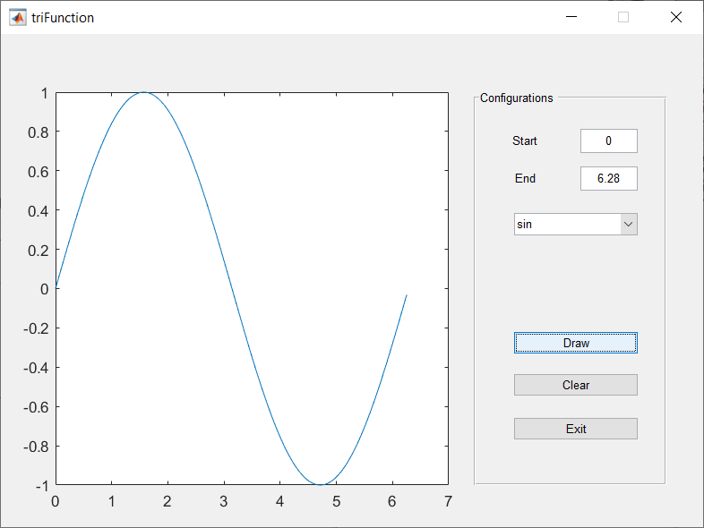

# MATLAB GUI trigonometric functions graph

<!-- TOC -->

- [MATLAB GUI trigonometric functions graph](#matlab-gui-trigonometric-functions-graph)
    - [Screenshot](#screenshot)

<!-- /TOC -->

1. MATLAB 2019a

## Screenshot

